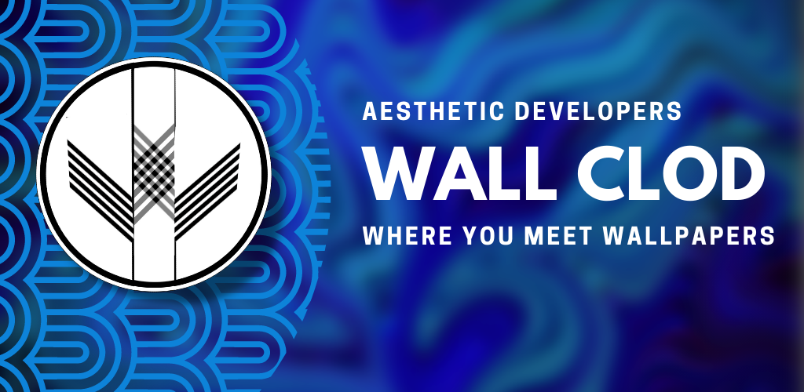
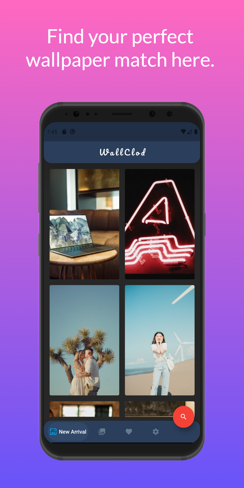
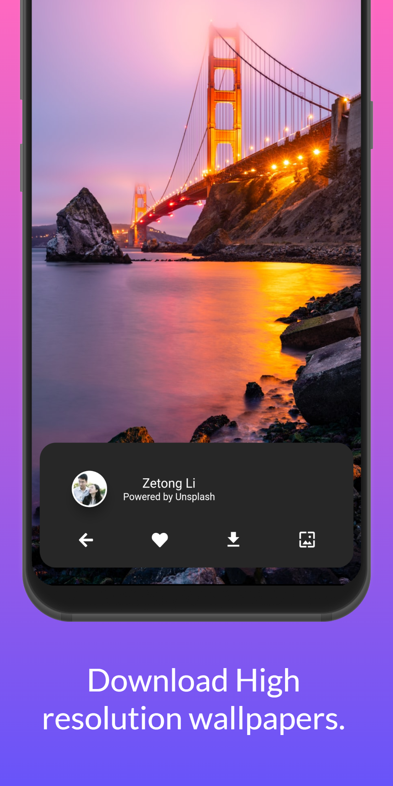
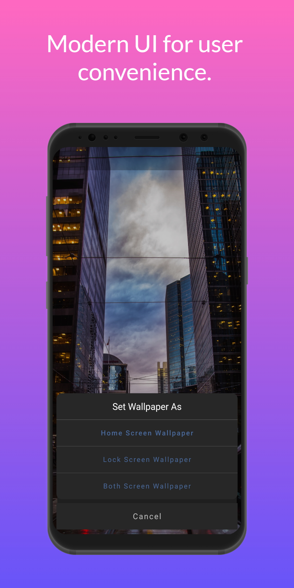
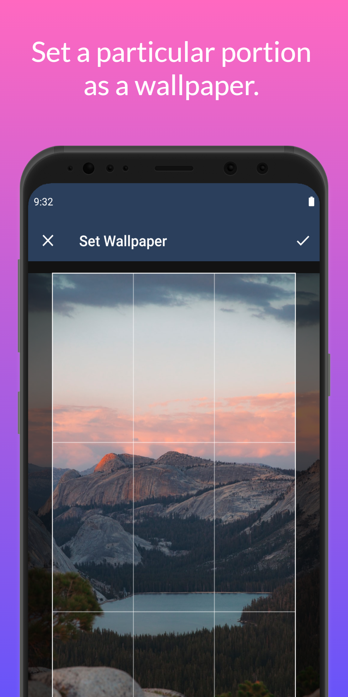
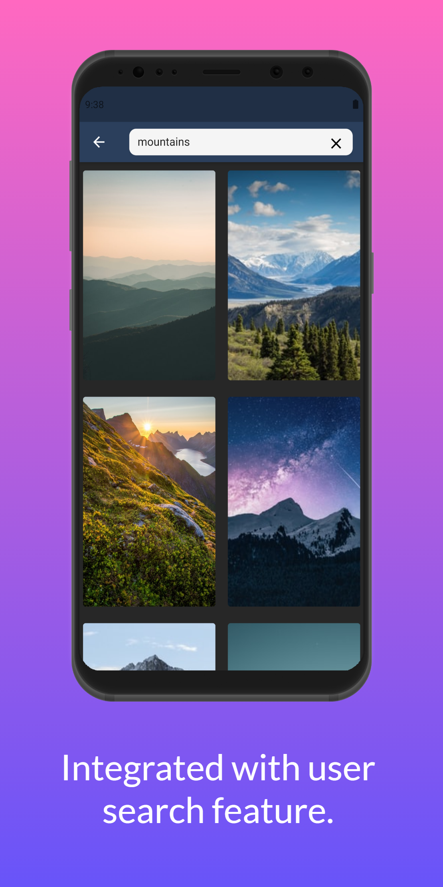
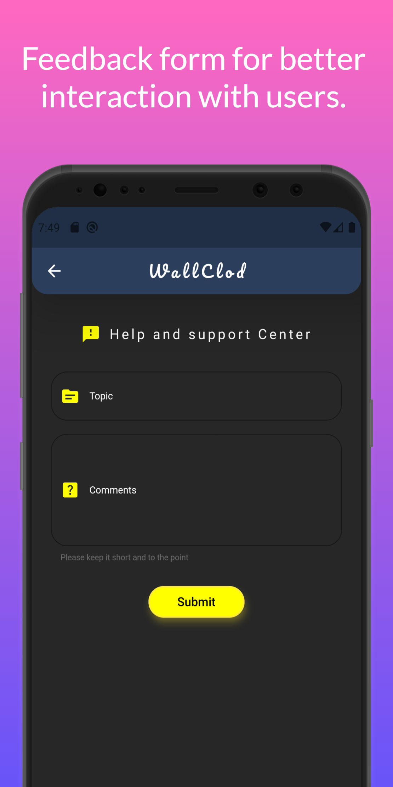
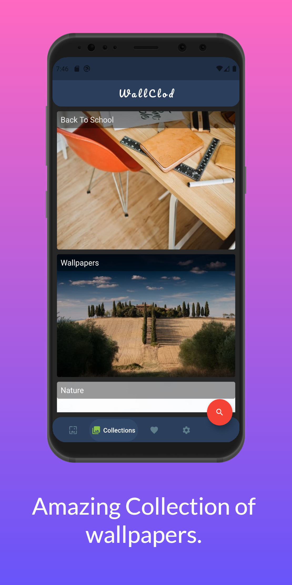
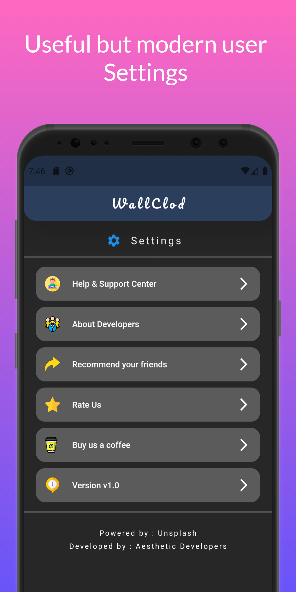

WallClod- Wallpapers

Type: API based Wallpaper Application.

WallClod-Wallpaper is an application based on Flutter framework and uses Dart as a language. It is your one stop destination for all sorts of amazing and best quality wallpapers from all around the world. 

Some of the main features of our application are:

1. Best Quality Images : The Images that are provided are Raw images which is the best image quality.
2. Amazing collection: We have covered you up with a large amount of collection of photos.
3. Domain Images: The images are well categorized into domains, that make access by the user easy.
4. Customized Search Bar: User can search through several wallpapers based on their keyword.
5. Custom Size Wallpapers: Customize which part of the image you want to set it as your wallpaper.
6. Dedicated Feedback Form: We have a dedicated feedback/Help and Support where you can directly come in touch with us, and we will be more than happy to help you.

Other than this function you have the Modern UI with other utilities like Favourites, Downloads, Share and many more to come.

And if you do like our work, you could help us by contributing through (Settings -> Buy us a Coffee).
We hope you all have a great experience with WallClod-Wallpapers.

We also want to thank Unsplash API for providing us with these Images.

Application Screenshots:

